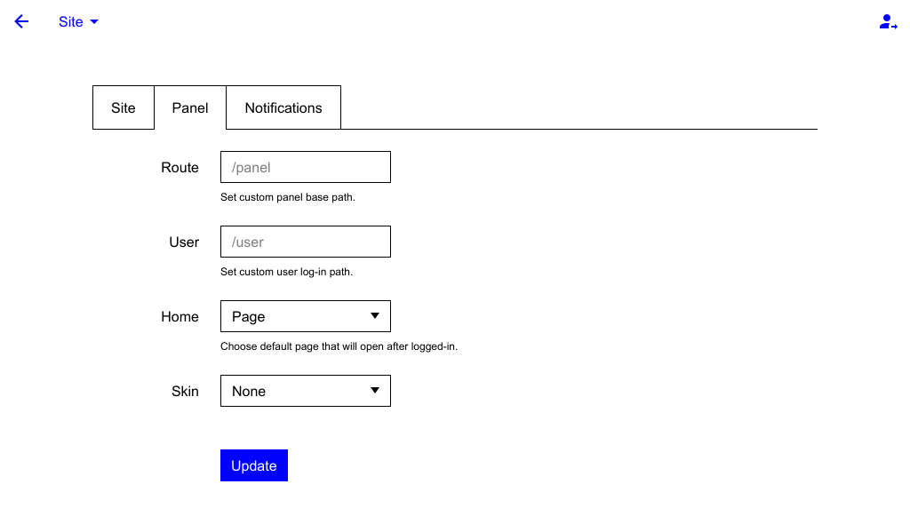

Skin Feature for Mecha’s [Panel](https://github.com/mecha-cms/x.panel)
======================================================================

This extension is required by the panel to activate the skin selector field on the state page.

